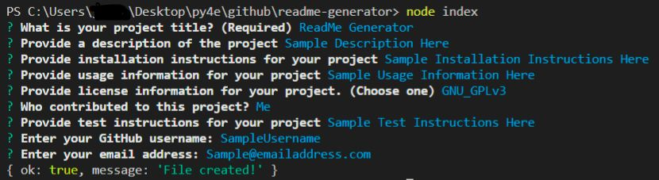
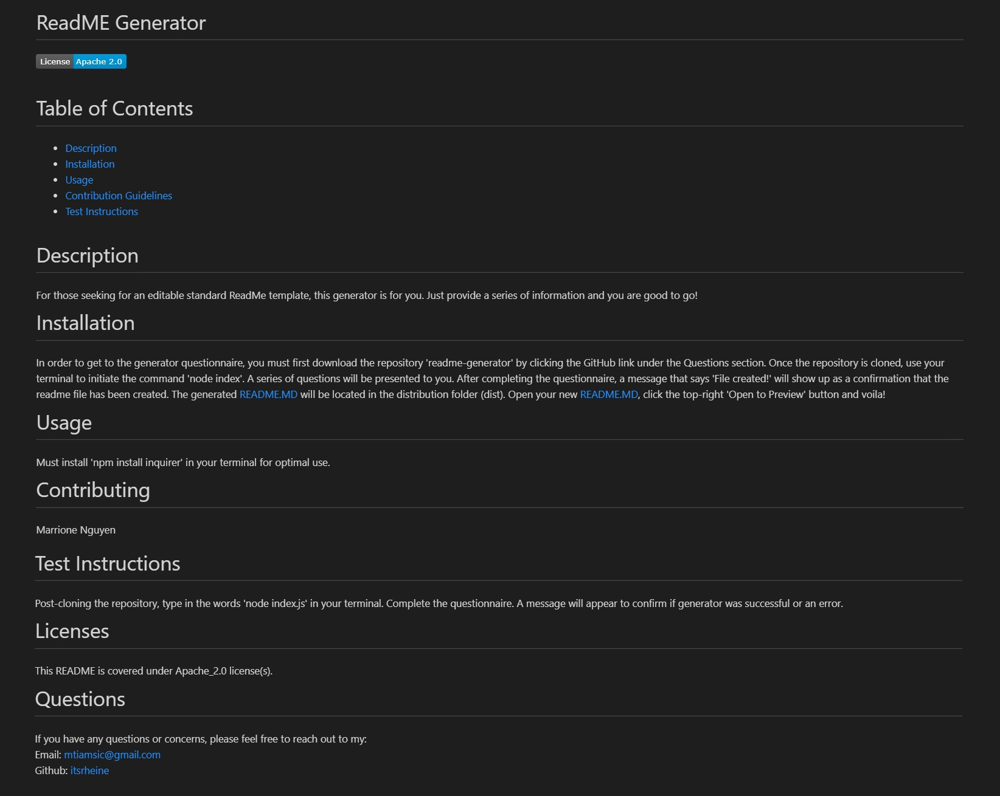

# ReadMe Generator
For those seeking for an editable standard ReadMe template, this generator is for you.
Just provide a series of information and you are good to go!

## Installation
In order to get to the generator questionnaire, you must first download the repository 'readme-generator' by clicking the GitHub link under the Questions section. 
Once the repository is cloned, use your terminal to initiate the command 'node index.js.'  A series of questions will be presented to you.  After completing the questionnaire,
a message that says 'File created!; will show up as a confirmation that the readme file has been created.  The generated README.MD will be located in the distribution folder (dist).
Open your new README.MD, click the top-right 'Open to Preview' button and voila!

## Created using
* Javascript
* Node.js
* ES6
* npm inquirer

## Link to Repository
https://github.com/itsrheine/readme-generator

## Link to Video
https://drive.google.com/file/d/1JS3tSb0p_5rS3xGap0_kqYj9p1Xhm9Dw/view

## Screencastify

## Screenshot

